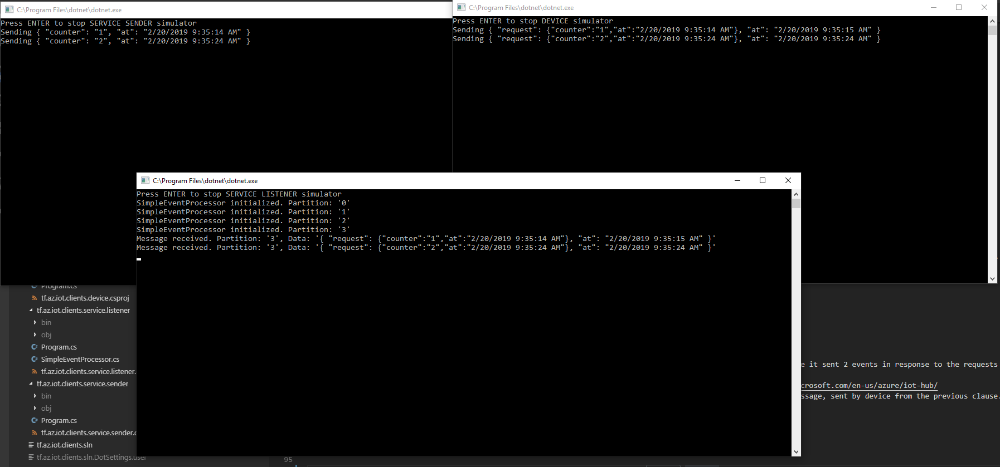
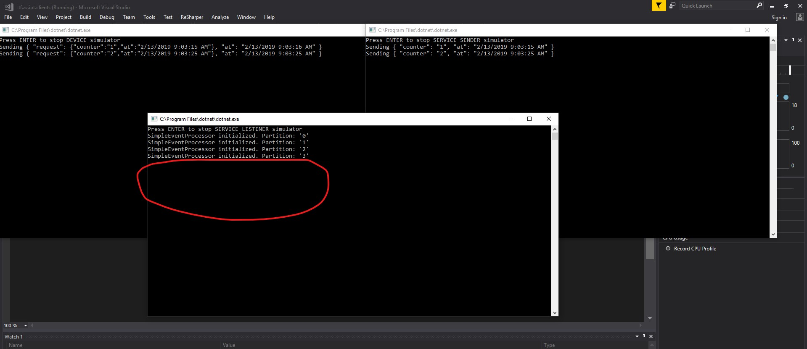

# Azure IoT Hub Direct Method verification

- [Azure IoT Hub Direct Method verification](#azure-iot-hub-direct-method-verification)
  - [Pre-requisites](#pre-requisites)
  - [Running the sample](#running-the-sample)
    - [Infrastructure provisioners](#infrastructure-provisioners)
      - [Terraform](#terraform)
      - [Azure command line interface](#azure-command-line-interface)
      - [ARM template](#arm-template)
    - [Dotnet projects](#dotnet-projects)
  - [Current status](#current-status)

The repository contains scripts and dotnet libraries to verify [direct-method communication](https://docs.microsoft.com/en-us/azure/iot-hub/iot-hub-devguide-direct-methods) channel for Azure IoT Hub

The repository structure:

- `arm_templates` - bash scripts and ARM template to create and delete Resource Group, Azure IoT Hub and Azure Storage Account.
- `cli` - bash scripts to create and delete Resource Group with Azure IoT Hub and a Storage Account.
- `clients` - c# clients to simulate cloud and device services:
  - `tf.az.iot.clients.device` - simulates device, which _listens_ to direct methods invocation and sends responses;
  - `tf.az.iot.clients.service.listener` - simulate service that _listents_ any device response;
  - `tf.az.iot.clients.service.sender` - simulate service that _invokes_ direct methods.
- `terraform` - terraform template to provision and destroy Resource Group with Azure IoT Hub and a Storage Account.

## Pre-requisites

Azure IoT Hub client projects are implemented with VS 2017 and uses `dotnet core 2.2`. To run the samples you need dotnet core SDK to be installed.

`arm_templates` and `cli` requires Azure CLI to be installed and `az login` command to be invoked before running scripts.

`terraform` template was built using terraform version `0.11.11`

## Running the sample

### Infrastructure provisioners

The repository has three provisioners that creates the same environment using different tools:

- Terraform template in `tf` folder
- Bash scripts with `az cli` commands in `cli` folder
- Bash scripts to create IoT Hub and Storage Account with ARM template in `arm_template` folder

Every provisioner as the last step generates `env.vars` file in the repository root folder. The file is required by dotnet projects.

#### Terraform

Navigate to `tf` folder with `cd ./tf`

To run terraform template

1. set corresponding values to `terraform.tfvars` file
2. `terraform init`
3. `terraform plan -out=tfplan`
4. `terraform apply tfplan`

To clean-up afterward:

1. `terraform destroy -auto-approve`
2. `rm ./tfplan`

#### Azure command line interface

Navigate to `cli` folder with `cd ./cli`

To run cli provisioner: `./az_create.sh $BASE_NAME $Location`. Where `$BASE_NAME` is used as prefix for Resource Group (`$BASE_NAME-rg`).

To clean-up: `./az_delete.sh $BASE_NAME`. Where `$BASE_NAME` should be the same as used in _create_ script

#### ARM template

Navigate to `arm_template` folder with `cd ./arm_template`

To run cli provisioner: `./az_create.sh $BASE_NAME $Location`. Where `$BASE_NAME` is used as prefix for Resource Group (`$BASE_NAME-rg`).

To clean-up: `./az_delete.sh $BASE_NAME`. Where `$BASE_NAME` should be the same as used in _create_ script

### Dotnet projects

Every dotnet project requires `env.vars` file with credentials to access Azure IoT Hub and/or Azure Storage Account. The file is autogenerated by bash scripts or terraform template.

To verify Direct Method communication channel start all three projects.

Sample output:

- right top corner is Direct Method invoker. You can see it sent 2 events
- left top corner is Device Simulator, which listens for Direct Methods invocation and responds to them. You can see it sent 2 events in response to the requests from the previous clause.
- at the bottom is device response listener, which is connected to built-in [device-2-cloud events](https://docs.microsoft.com/en-us/azure/iot-hub/iot-hub-devguide-messages-read-builtin) endpoint.

## Current status

At the moment, Azure IoT Hub provisioned with Terraform template does not provide `device-2-cloud` events:

The same functionality works fine for IoT Hub created by ARM templates or with `az cli` commands